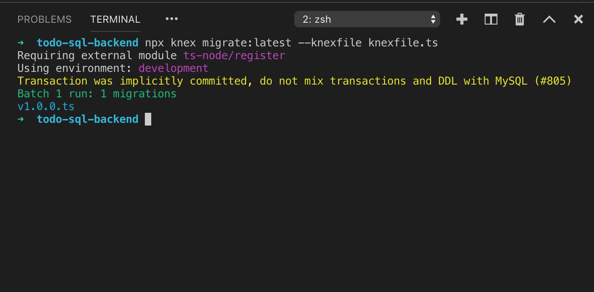

> **Info**  
> This is the third part of 10 steps tutorial on creating basic SQL restful API. Check navigation to navigate to other steps.

Database migration is a good solution to version control our database schema, its a part of continuous delivery to help deployment run smoothly. 

In this section We will use MySQL database and connect to database using [Knex.js](https://knexjs.org/) migration tools.

> Knex.js currently support various SQL database: Postgres, MSSQL, MySQL, MariaDB, SQLite3, Oracle, and Amazon Redshift.

## Install Packages
Basic rest api starter already contains some required packages. We will need another packages to interact with database. Enter command below from Visual Studio Code integrated terminal (Add new terminal if the current terminal used by the `start` script)

```bash
$ yarn add knex @types/knex mysql2 bcrypt @types/bcrypt
```

Above command will install Knex.js its typing and MySQL package, we don't need MySQL typings because we won't interact directly with it.


## Create Database
Create an empty database using any MySQL client such as: phpMyAdmin or MySQL Command Line Client.

If you are using MySQL Command Line Client than enter command below:

```bash
# login to mysql using root or other user
$ mysql -uroot -p
# create database 
mysql> create database todo;
```

## Add Configuration File
Before start creating database migration, we need to setup configuration file to provide database uri. 

Rename the `.env.example` file in the root directory into `.env` and add values below

```env
PORT=8000
DB_URI="mysql://<user>:<password>@localhost/todo"
```

Change `<user>` and `<password>` match your MySQL configuration. `todo` is the database name that we created previously.

`.env` file above will be loaded on application startup by using `dotenv` package and the value will be available from `process.env`. For example `process.env.PORT` and `process.env.DB_URI`.

## Add Configuration Typings
We added `DB_URI` field on our configuration file, but for a moment TypeScript will not be able to provide intellisense (auto complete) for the field. So if we mistype `process.env.DBURI` TypeScript will not notice the problem.

Project starter provide typings file `src/config.d.ts` that will [augment](https://www.typescriptlang.org/docs/handbook/declaration-merging.html#module-augmentation) the `process.env`, so we will be able to add type check and intellisense for new configuration.

Navigate to `src/config.d.ts` and add `DB_URI` property on `ProcessEnv` interface

```typescript
declare namespace NodeJS {
    export interface ProcessEnv {
        PORT: string
        DB_URI: string //<-- add this
    }
}
```

By adding above property, TypeScript will be able to provide intellisense for the `DB_URI` on the `process.env.DB_URI`

## Create Database Migration
Start configuring migration by adding `knexfile.ts` in the  root project directory, and type code below:

```typescript
import { Config } from "knex";
import dotenv from "dotenv"

dotenv.load()

export const configuration: Config = {
    client: 'mysql2',
    connection: process.env.DB_URI,
    migrations: {
        tableName: '_knex_migrations',
        directory: "./db/migrations"
    },
    seeds: {
        directory: "./db/seeds"
    }
}
export const development: Config = { ...configuration }
export const production: Config = { ...configuration }
```

File above will be used by Knex.js migration tool to locate the migration file, seeds file and some basic database configuration. It loads `.env` to fill the `DB_URI` configuration.

Next we need to create migration file for the first version of our application. Create new file inside `db/migrations` directory named `v1.0.0.ts` and write code below

```typescript
import * as Knex from "knex";

function baseTable(t: Knex.CreateTableBuilder, knex: Knex) {
    t.bigIncrements("id")
    t.timestamp("createdAt").defaultTo(knex.fn.now())
    t.boolean("deleted").defaultTo(false)
}

export async function up(knex: Knex): Promise<any> {
    return knex.transaction(trx => {
        return trx.schema
            .createTable("User", t => {
                baseTable(t, trx)
                t.string("email")
                t.string("password")
                t.string("name")
                t.string("role")
            })
            .createTable("Todo", t => {
                baseTable(t, trx)
                t.string("todo")
                t.bigInteger("userId").unsigned().references("id").inTable("User")
                t.boolean("completed").defaultTo(false)
            })
    })
};

export async function down(knex: Knex): Promise<any> {
    return knex.transaction(trx => {
        return trx.schema
            .dropTable("Todo")
            .dropTable("User")
    })
};
```

Code above will create two tables `User` and `Todo`. Each table has the same columns with the appropriate domain. `User` domain will represent `User` table and `Todo` domain represent `Todo` table.

We define a common function `baseTable` to setup columns defined in `Domain` base class to prevent duplication.

Then we provided the `up` and `down` function for Knex.js migration tool for migrate and rollback function.

Keep in mind that the order of the table creation/deletion is important. On `up` function parent table should be created first then child table should be the last. On `down` function child table should be dropped first then parent table.

## Create Seeds
Seeds used to add some default value to created table after migration. We need to add default value for our application administration user, so we have the first user used to manage the application.

Create directory `db/seeds` and add file named `seeds.ts` then write code below.

```typescript
import * as Knex from "knex";
import { User } from "../../src/model/domain";
import bcrypt from "bcrypt"

async function addDefaultAdmin(knex:Knex){
    const defaultUserEmail = "admin@todo.app"
    const defaultUserPassword = await bcrypt.hash("123456", 10)
    const exists = await knex.table("User").where({email: defaultUserEmail}).first()
    if(!exists){
        await knex.table("User").insert(<User>{
            email: defaultUserEmail,
            password: defaultUserPassword,
            name: "Todo Admin",
            role: "Admin"
        })
    }
}

export function seed(knex: Knex): Promise<any> {
    return Promise.all([
        addDefaultAdmin(knex)
    ])
}
```

`seed` function will be called by Knex.js migration tools, we need to execute the command separately after migration.

`addDefaultAdmin` function will check for existing user by 

## Execute Migrations and Seeds
Our setup is ready for testing database migration, open Visual Studio Integrated terminal and enter command below to execute the database migration.

```bash
$ npx knex --knexfile knexfile.ts migrate:latest 
```

If you follow all the step above, migration tool will print message like picture below



Check if tables created successfully by using MySQL client application. 

If we confirmed the table created successfully we can execute the seeds to add the default admin

```bash
$ npx knex --knexfile knexfile.ts seed:run 
```

Above code should add default admin to the `User` table. You can check using MySQL client application like below.


